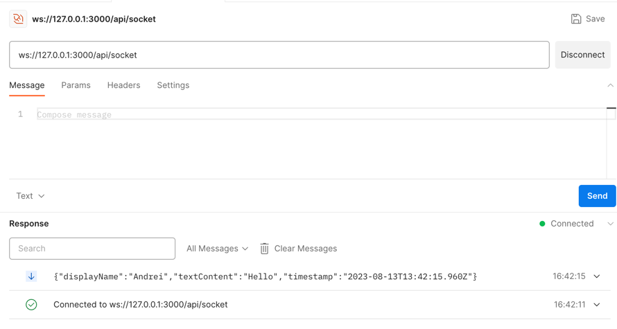
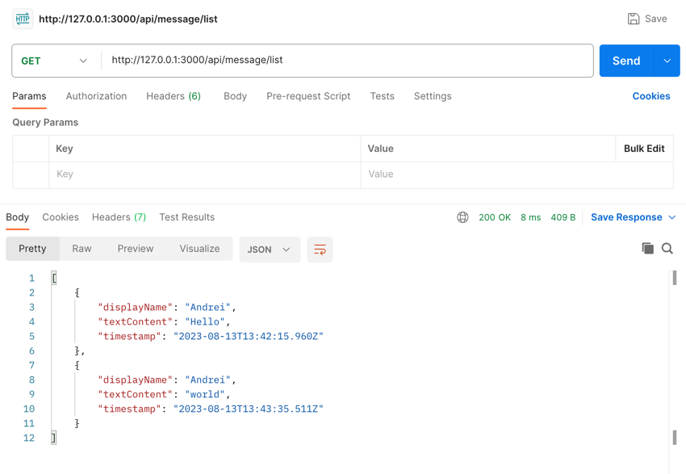
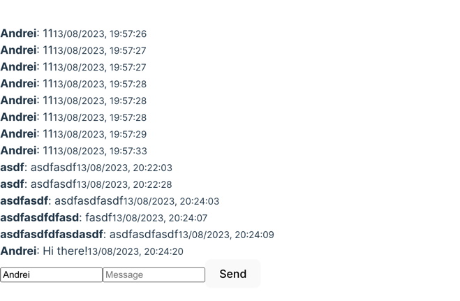

Hi there!

It is a log of my development process.

I decided to write down all my thoughts and decisions in a log.

Each title is a commit

## 1. Init app (760a0474)

I'm setting up an application comprising both frontend and backend. To speed up the setup, I've considered the following
boilerplates:

- [Vite](https://expressjs.com/en/starter/generator.html)
- [Express Generator](https://vitejs.dev/guide/)
- [NPM Workspaces](https://docs.npmjs.com/cli/v9/using-npm/workspaces?v=true)

## 2. Backend Code Refresh (e4433ee8)

About `npx express-generator`: I noticed it was a bit outdated, primarily utilizing older syntax (like CommonJS). To
modernize the codebase,
I updated it to leverage ES6 syntax and removed unnecessary (for me) libs and files.

## 3. Add backend MVP (05141b91)

I quickly made a draft working code for the backend in few files.

Funny, it's a Nodejs task, but the frontend work is twice as much 😅
I made a plan for myself, and it looks exactly like this.

## 4. Migrate to MVC (f04f110b)

Because project is small, I've chosen to implement the MVC architecture pattern.

Additionally, I added

- ./core - code for start application
- ./libs - collection of utilities, organized into directories in a DDD-like fashion

For simplicity, I decided to omit certain entities, such as Middlewares, Services, and etc., distributing them among the
existing ones

I decided to skip the tests for now, as I'm not sure if I'll have enough time to write them.

## 5. Add frontend MVP (23a0e478)

I've added a frontend MVP, which is a simple form with a single input and a button.

The weirdest thing is that it worked on the first try. Spent 20 minutes, haha.

## 6. Add MobX Store (e1fd475b)

Last time I tried Redux (https://github.com/AndreiSoroka/cart-component/tree/master),
and I can say that I didn't like
Redux. That's why I decided to try MobX, and it turned out to
be very, very interesting.

I created a store where the logic for working with messages is encapsulated:

- Storing messages
- Sending messages
- Retrieving messages
- Handling errors

For now, I've simply drafted the code without giving it much thought. I'll likely refactor it later, depending on the
time.

## Add Ant Design (7ec3d661)

Hi there!
Today, I integrated Ant Design into the project. I've previously used it with Vue.js (and it wasn't a great fit for
Vue.js). However, this is my first time using it with React. I must say, this component library works well with
React! :)

Of course, I spent some time on AntD + MobX and encountered a few pitfalls.

## Migrate to FSD (efdbc521)

I've decided to use the [FSD](https://feature-sliced.design/) methodology.

The first time I tried it was
here: https://github.com/AndreiSoroka/cart-component/tree/master.
However, I only truly appreciated this structure later on.

The project is working. Now I need to decide what I want to showcase in the test assignment.

- Code quality?
- Architecture?
- Structure?
- Features?
- Design?

I still have 4 days left (out of 7), but this time I don't have much free time to even dedicate a full working day to
it.

I will make a decision tomorrow

## Add Prettier (1d198120)

My motto is:

> If it's not automated, it's subjective.

It doesn't matter to me in what code style to write, the main thing is that in one style

To ensure the code follows a consistent style, I've added
Prettier.

## Add Husky (b08af589)

A bit more automation. I've added Husky to run Prettier and Eslint before each commit.

## Fix message loss bug between fetch and socket connection

Just fix bug
