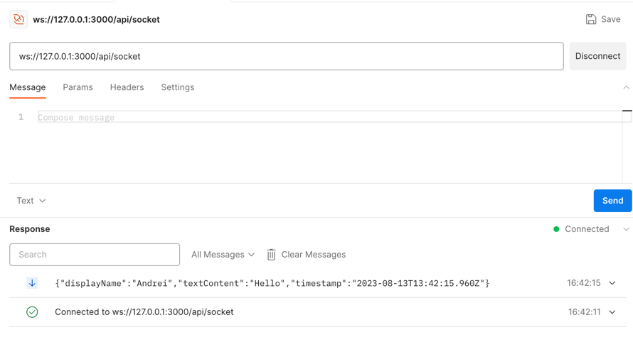
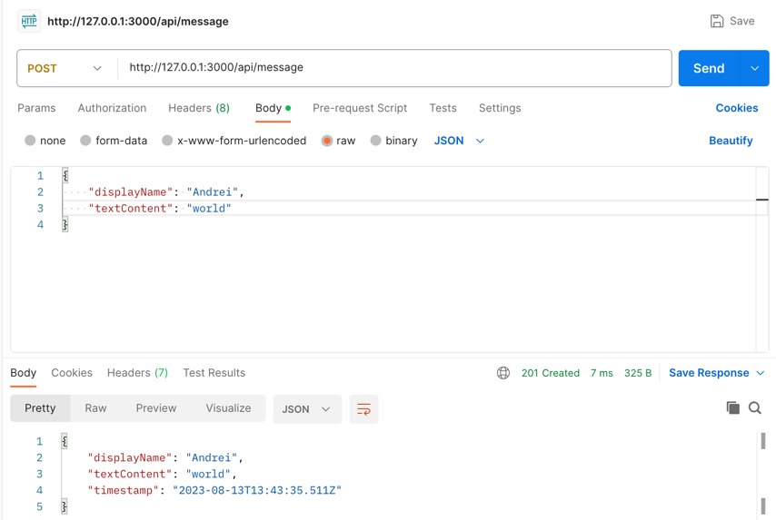
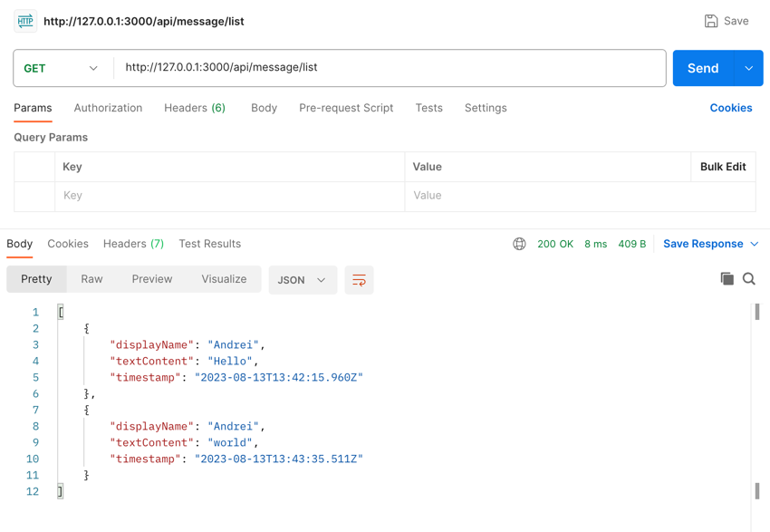
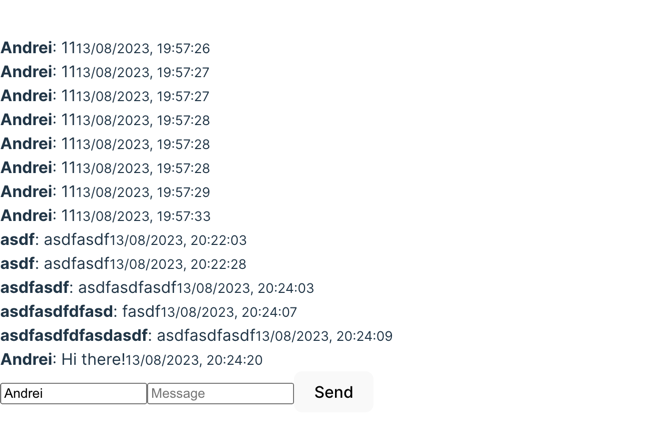

Hi there!

It is a log of my development process.

I decided to write down all my thoughts and decisions in a log.

Each title is a commit

## 1. Init app (760a0474)

I'm setting up an application comprising both frontend and backend. To speed up the setup, I've considered the following
boilerplates:

- [Vite](https://expressjs.com/en/starter/generator.html)
- [Express Generator](https://vitejs.dev/guide/)
- [NPM Workspaces](https://docs.npmjs.com/cli/v9/using-npm/workspaces?v=true)

## 2. Backend Code Refresh (e4433ee8)

About `npx express-generator`: I noticed it was a bit outdated, primarily utilizing older syntax (like CommonJS). To
modernize the codebase,
I updated it to leverage ES6 syntax and removed unnecessary (for me) libs and files.

## 3. Add backend MVP (05141b91)

I quickly made a draft working code for the backend in few files.

Funny, it's a Nodejs task, but the frontend work is twice as much 😅
I made a plan for myself, and it looks exactly like this.

## 4. Migrate to MVC

Because project is small, I've chosen to implement the MVC architecture pattern.

Additionally, I added

- ./core - code for start application
- ./libs - collection of utilities, organized into directories in a DDD-like fashion

For simplicity, I decided to omit certain entities, such as Middlewares, Services, and etc., distributing them among the
existing ones

I decided to skip the tests for now, as I'm not sure if I'll have enough time to write them.

## 5. Add frontend MVP

I've added a frontend MVP, which is a simple form with a single input and a button.

The weirdest thing is that it worked on the first try. Spent 20 minutes, haha.
